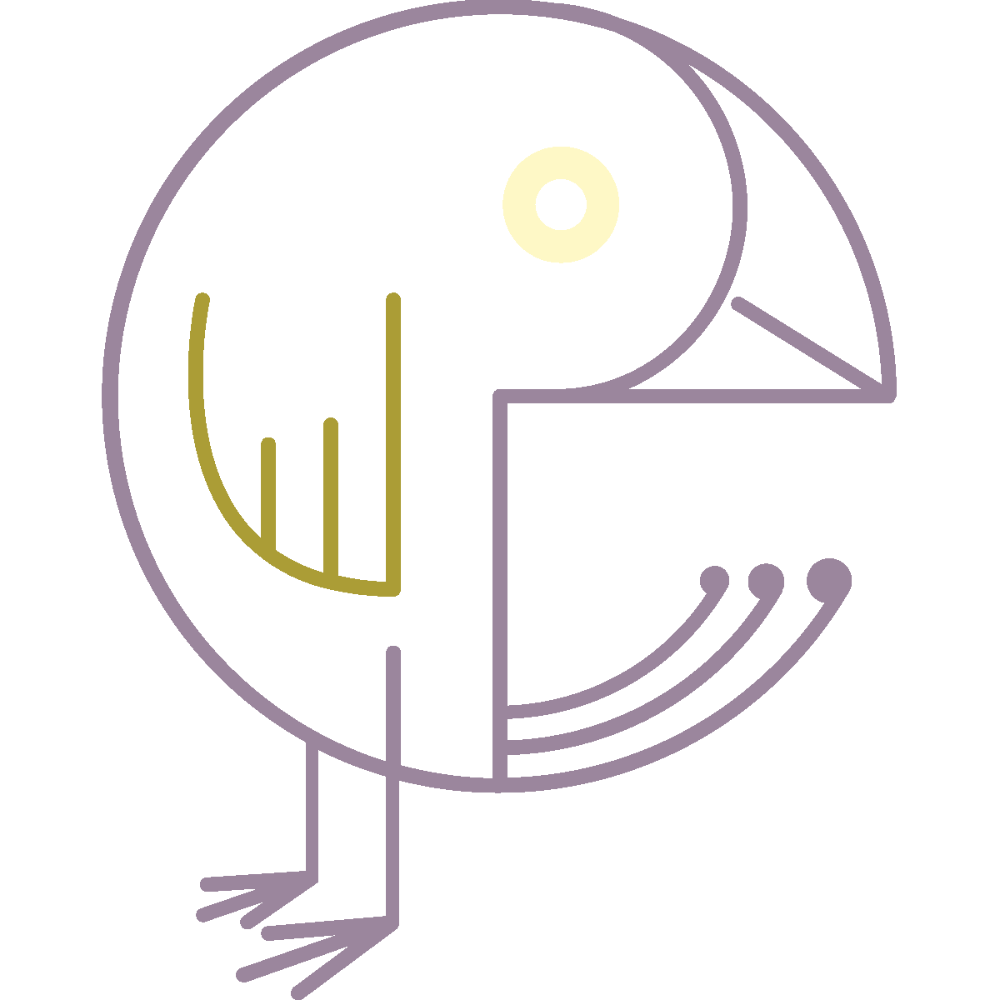

# JubJubWord
### Powered by the [JubJub Bird](https://www.poetryfoundation.org/poems/42916/jabberwocky)

this web app has one purpose[^1]: generate plausibly deniable gibberish à la [Ed Bassmaster](https://www.youtube.com/watch?v=t18Fpbi1MI0)

[^1]: It really has two purposes: the second one, as the first has yet been listed above, is a tinkering-ground for me to play with [markov chains](https://setosa.io/ev/markov-chains/)
